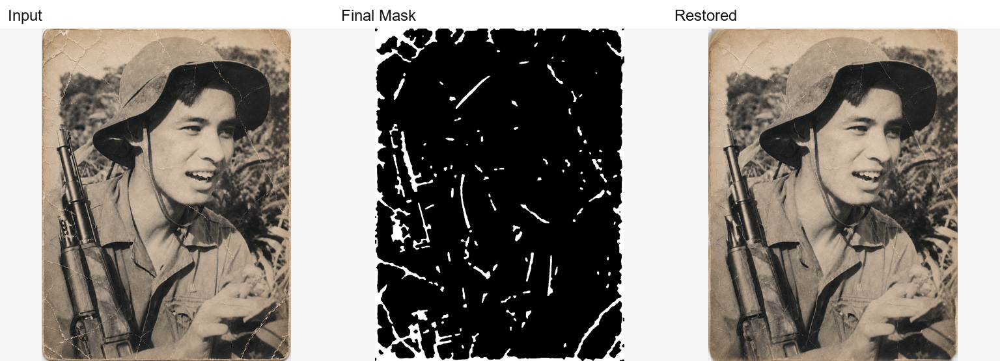
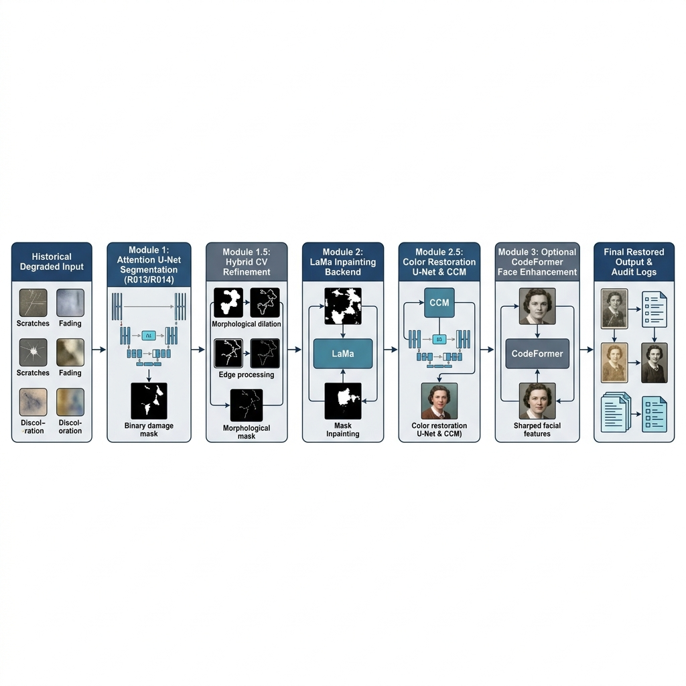

<div align="center">

# Deep Learning Old Photo Restoration

### Modular, Audited, & Claim-Safe Historical Image Restoration Pipeline

**Damage Segmentation · Hybrid Mask Refinement · LaMa Inpainting · Color Restoration · Face Restoration**

<br>

[](https://www.python.org/)
[](https://pytorch.org/)
[](https://opencv.org/)
[](docs/demo_script.md)
[](docs/deployment.md)

<br>



<sub><b>Input Image</b> &nbsp;→&nbsp; <b>Predicted Hybrid Repair Mask</b> &nbsp;→&nbsp; <b>LaMa Inpainting Restoration</b></sub>

</div>

---

## Overview

Most generative restoration frameworks attempt to solve image degradation using an opaque, end-to-end black box. While visually appealing on cherry-picked samples, single-pass models frequently hallucinate details, smear structural boundaries, and fail on historical crack patterns.

This repository implements a **decoupled, modular restoration pipeline** that isolates individual tasks into independently observable and auditable stages:
1. **Module 1: Damage & Crack Segmentation** — Predicts defect probability masks using an `Attention U-Net` (`R013` operational baseline or `R014 ResNet-34` experimental encoder).
2. **Module 1.5: Hybrid Mask Refinement (`repair_wide_v1`)** — Combines deep learning masks with classical computer vision (`CLAHE`, `Blackhat`, `Canny`) and morphological union to capture fine scratches before inpainting.
3. **Module 2: Inpainting Backend** — Wraps official pretrained `LaMa` (Resolution-robust Large Mask Inpainting) via subprocess execution to regenerate missing pixels cleanly.
4. **Module 2.5: Post-Inpainting Color & Quality Restoration** — Recovers tonal balance and visual sharpness using a specialized multi-stage `Color Restoration U-Net` and CCM alignment.
5. **Module 3: Optional Face Restoration** — Integrates `CodeFormer` + `RetinaFace` (`--face-mode auto`) as an optional enhancement layer for degraded portrait features.

---

## Architecture Flow

<div align="center">
  
</div>

```text
┌──────────────────────────────────────────────────────────────┐
│                        DEGRADED RGB                          │
└──────────────────────────────┬───────────────────────────────┘
                               │
                               ▼
┌──────────────────────────────────────────────────────────────┐
│ MODULE 1 & 1.5: DAMAGE SEGMENTATION & HYBRID REFINEMENT      │
│ • Deep Learning: Attention U-Net (R013 baseline / R014)      │
│ • Classical CV: CLAHE + Blackhat + Canny                     │
│ • Policy: repair_wide_v1 morphological dilation & union      │
└──────────────────────────────┬───────────────────────────────┘
                               │ [Output: final_mask.png]
                               ▼
┌──────────────────────────────────────────────────────────────┐
│ MODULE 2: LAMA INPAINTING BACKEND (OFFICIAL SUBPROCESS)      │
└──────────────────────────────┬───────────────────────────────┘
                               │ [Output: lama_restored.png]
                               ▼
┌──────────────────────────────────────────────────────────────┐
│ MODULE 2.5: POST-INPAINTING COLOR RESTORATION     [OPTIONAL] │
│ • Quality restoration & Color Restoration U-Net              │
│ • Inference control & CCM color correction                   │
└──────────────────────────────┬───────────────────────────────┘
                               │ [Output: color_restored.png]
                               ▼
┌──────────────────────────────────────────────────────────────┐
│ MODULE 3: FACE RESTORATION (CODEFORMER)           [OPTIONAL] │
└──────────────────────────────┬───────────────────────────────┘
                               │ [Output: codeformer_output.png]
                               ▼
┌──────────────────────────────────────────────────────────────┐
│ CANONICAL RESTORED ARTIFACTS (`metadata.json` & Logs)        │
└──────────────────────────────────────────────────────────────┘
```

---

## Key Scientific Contributions & Audited Performance

### 1. Domain-Isolated Modular Decomposition
Unlike monolithic black-box networks that couple segmentation and generation into a single uninterpretable latent space, this framework decouples **Damage Localization (`Module 1 & 1.5`)** from **Generative Inpainting (`Module 2`)**. This prevents error propagation, allows independent stage auditing, and enables clean regression tracking without retraining the heavy generative backend.

### 2. Audited Segmentation Models (`R013` vs `R014`)
- **`R013` (Operational Baseline)**: Custom lightweight Attention U-Net with Attention Gates that filter skip connections, focusing the decoder on thin crack structures (`Test IoU = 0.3456`, `F1 = 0.5502` @ threshold `0.50` evaluated on the fixed `118` real-world pair split `masks_fixed`).
- **`R014` (ResNet-34 Experimental Variant)**: Replaces the encoder block with ImageNet-pretrained `ResNet-34`. While achieving higher raw segmentation precision (`IoU = 0.4506`, `F1 = 0.6213`), downstream ablation proves that raw segmentation precision does not automatically maximize overall full-frame PSNR (`17.99 dB` oracle bound vs `17.35 dB` auto). R014 is maintained as an optional CLI variant (`--segmenter-arch r014_resnet34`) alongside a `$3\times3$` morphological dilation (`repair_wide_v1`).

### 3. Self-Contained Data Synthesis & Class Imbalance Loss Mechanics
To resolve the scarcity of real-world historical ground truth, our built-in engine (`src/old_photo_restoration/data/synthesis_engine.py`) generates `(damaged, clean, mask)` training triples by blending high-resolution clean references (`DIV2K`) with real crack annotations (`CrackForest`).
Because thin scratches occupy $<3\%$ of total pixels, the training mechanics (`src/old_photo_restoration/training/losses.py`) employ a balanced `BCEDiceLoss` (`0.5*BCE + 0.5*Dice`) and `FocalLoss` to heavily penalize false negatives and capture faint structural defects.

---

## Quick-Start & Setup

To keep the repository lightweight and clean, large checkpoint binaries (`.pth`, `.ckpt`) and external source trees (`LaMa`, `CodeFormer`) are **strictly excluded from Git tracking**. You must link your local runtimes via `configs/external_paths.yaml`.

### 1. Clone & Install Dependencies
```bash
git clone https://github.com/doraIaIa/deep-learning-old-photo-restoration.git
cd deep-learning-old-photo-restoration

python -m venv .venv
source .venv/bin/activate  # Windows: .venv\Scripts\Activate.ps1
python -m pip install --upgrade pip
python -m pip install -r requirements.txt
```

### 2. Configure External Runtime Paths
Copy the template configuration and set the absolute paths to your local LaMa and optional CodeFormer directories:
```bash
cp configs/external_paths.example.yaml configs/external_paths.yaml
```
```yaml
lama:
  repo_root: /absolute/path/to/lama
  checkpoint: /absolute/path/to/big-lama-best.ckpt
  conda_env_preferred: lama_gpu
  conda_env_fallback: lama

codeformer:
  repo_root: /absolute/path/to/CodeFormer
  checkpoint: /absolute/path/to/codeformer.pth
  conda_env: codeformer
```

### 3. Verify Environment Readiness
Audit your local checkpoints, Python environment, and SHA256 integrity before running inference:
```bash
python scripts/check_readiness.py --strict
```

---

## Usage Guide

Execute all CLI entry points from the root directory.

### CLI Pipeline Execution
Run the core segmentation and LaMa inpainting pipeline on a single image:
```bash
python scripts/run_pipeline.py \
  --image examples/inputs/demo3.png \
  --output-dir outputs/demo3_core
```

Run the complete pipeline including **Color Restoration** and **Face Restoration**:
```bash
python scripts/run_pipeline.py \
  --image examples/inputs/demo3.png \
  --output-dir outputs/demo3_full \
  --post-inpainting \
  --face-mode auto
```

### Standalone Color Restoration
Run the standalone color and quality recovery module directly on pre-inpainted images:
```bash
python scripts/run_color_restoration.py \
  --input path/to/lama_restored.png \
  --output-dir outputs/color_run \
  --method model
```

### Interactive Gradio Web Demo
Launch the interactive web UI for real-time experimentation and stage-by-stage inspection:
```bash
python scripts/run_gradio_demo.py
```
Open your browser at `http://127.0.0.1:7860`.

### Docker Deployment Skeleton
Build and run via Docker Compose for local containerized evaluation:
```bash
docker compose up --build
```
*(Note: Ensure your external model checkpoints are mounted cleanly into the container).*

---

## Scientific Boundaries & Claim Safety

We enforce strict transparency regarding our contributions:
- **Audited Module 1 Baseline**: Our operational segmenter (`R013`) is verified on `118` valid image-mask pairs (`masks_fixed`) with a fixed `83 / 18 / 17` split, achieving `Test IoU = 0.3456` @ `0.50` threshold (`+0.0911 IoU` improvement over `R011`).
- **Pretrained LaMa Wrapper**: LaMa is utilized purely via subprocess wrapper (`LamaInpainter`). **No fine-tuning of LaMa is claimed.**
- **Deferred Generative Metrics**: Full-image `LPIPS` and `FID` benchmarks belong to future work and are `not claimed` as completed.
- **Optional Face Restoration**: `CodeFormer` is a dependency-gated module and provides **no identity-preservation guarantee**.

---

## Documentation Navigation

Deep technical evaluations, training lineages, and architectural decisions are documented thoroughly in `/docs`:

| Documentation | Description |
|---|---|
| **[Architecture & Design](docs/architecture.md)** | Technical breakdown of all modules, contracts, and stage boundaries |
| **[Data Synthesis Guide (`ds-crack3d`)](docs/data_synthesis_guide.md)** | Methodology and CLI commands for generating synthetic crack/scratch training triples |
| **[Model Training & Fine-Tuning Guide](docs/training_guide.md)** | Instructions for training Attention U-Net (`R013`/`R014`) from scratch and domain fine-tuning |
| **[Restoration Evaluation](docs/restoration_evaluation.md)** | Quantitative reports, full-image vs. masked-region `MAE`/`PSNR`, and oracle ablation |
| **[Experiment Lineage](docs/experiment_summary.md)** | Historical failure-driven iterations from `R006` through `R014` |
| **[Reproducibility Guide](docs/reproducibility.md)** | Exact `demo3` replay commands and audited baseline facts |
| **[Scope & Claim-Safety](docs/scope_and_claim_safety.md)** | Explicit scientific boundaries and artifact packaging policies |
| **[Evaluation Protocol](docs/evaluation_protocol.md)** | Current evaluation scope and metric validation definitions |
| **[External Dependencies](docs/external_dependencies.md)** | Runtime wrappers for LaMa, CodeFormer, and external configurations |
| **[CLI & Scripts Guide](scripts/README.md)** | Comprehensive usage instructions for all utilities and entry points |
| **[Demo Script & Presentation Guide](docs/demo_script.md)** | Suggested 3–5 minute academic walkthrough talking points |

---

## Contributing & Hygiene

1. **Test Suite**: Always run unit and integration tests before submitting pull requests:
   ```bash
   python -m pytest -q
   ```
2. **Artifact Integrity**: Verify dataset and checkpoint manifests after modifying policies:
   ```bash
   python scripts/verify_artifacts.py check-all --repo-root .
   ```
3. **No Binaries in Git**: Large weights (`.pth`, `.ckpt`), raw image datasets, and scratch outputs must remain local and ignored by Git.

---

## License & Acknowledgments

This project incorporates:
- [LaMa (Resolution-robust Large Mask Inpainting)](https://github.com/advimman/lama) as the pretrained inpainting backend.
- [CodeFormer](https://github.com/sczhou/CodeFormer) for optional face restoration.
- PyTorch, OpenCV, Gradio, Pillow, PyYAML, and Kornia.

Developed for academic research and evaluation in **Deep Learning**. Ensure compliance with individual open-source licenses when distributing external weights or subcomponents outside of academic environments.
